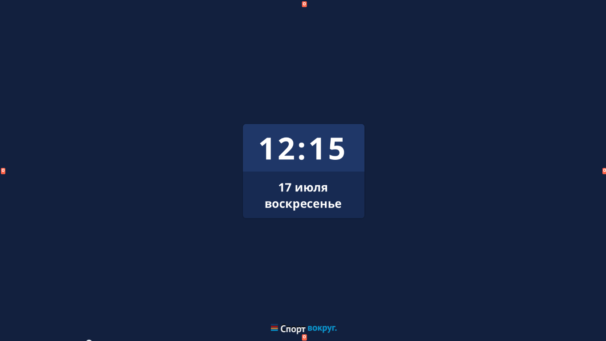
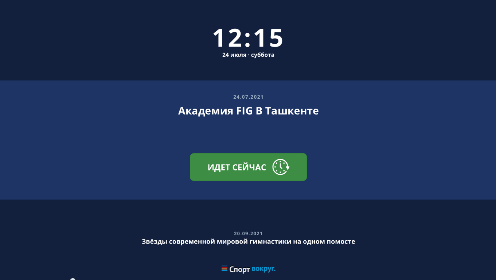

### Что бы запустить проект, нужно выполнить последовательно следующие команды:

```bash
pnpm install
```

```bash
pnpm run start
```


# ТЗ  
Нужно реализовать отображение информации о текущем или планируемых мероприятиях.
Что должно отображаться:
текущие дата и время
текущее / ближайшее мероприятие
следующее по списку мероприятие


Текущие дата и время должны отображаться всегда.

Если текущего / ближайшего мероприятия нет, то отображается только дата и время.



все элементы должны быть отцентрованы по ширине экрана)


текущее время в формате ЧЧ:ММ


Если нет текущего (идет сейчас) но есть ближайшее мероприятия то оно отображается в центральной части экрана.
Мероприятие, следующее за текущим / ближайшим (если нет текущего), если есть - отображается в самом низу экрана.


Если мероприятие идет сейчас (текущее), то вместо таймера отображается знак “идет сейчас”.


Если мероприятие помечено как “ключевое” (is_main = true), то оно всегда выводится первой строкой. Второй строкой выводится ближайшее мероприятие.


Форматирование части с информацией о текущем / ближайшем мероприятии:
Даты проведения мероприятия:
если мероприятие проходит в один день, в формате ДД.ММ.ГГГГ (например, 17.07.2022);
если мероприятие проходит в несколько дней в пределах одного месяца, в формате ДД-ДД.ММ.ГГГГ (например, 17-19.07.2022);
если мероприятие проходит в несколько дней в разных месяцах одного года, в формате ДД.ММ-ДД.ММ.ГГГГ;
если мероприятие проходит в несколько дней в разных годах, в формате ДД.ММ.ГГГГ-ДД.ММ.ГГГГ;
Название мероприятия
поле текста занимает 65% от ширины экрана;
если текст не помещается в одну строку, то отображать его в две строки (также занимают 65% от ширины экрана, и располагаются по центру);
если текст не помещается в 2 строки, то не поместившуюся часть названия скрывать под ... ;
в 3 строки текст не отображать;
счетчик обратного отчета в виде виджета  [Х дней, Х часов, Х минут, Х секунд]:
заполнение кольца уменьшается по прошествии каждой единицы времени, указанной в кольце;
полное кольцо в счетчике это 7 дней/24 часа/60 минут/60 секунд. Если мероприятие проходит через 12 дней, то сначала показываем кольцо для 5 дней с обратным отсчетом, а потом для оставшихся 7;
виджет всегда должен находиться в одном месте, независимо от количества строк, занимаемых Названием мероприятия

Форматирование части с информацией о следующем мероприятии
Даты проведения следующего мероприятия (формат - аналогично датам ближайшего мероприятия)
Название следующего мероприятия:
поле текста занимает не более 65% от ширины экрана;
если текст не помещается в 1 строку, то не поместившуюся часть названия скрывать под …


Логотип “Спорт вокруг” можно не показывать.


Все должно работать в “реальном времени”, т.е. при изменении списка мероприятий на сервере эти изменения должны отобразиться на экране. Работу в “реальном времени” можно реализовать при помощи таймера.


Для выполнения задания потребуется получить данные с сервера.
Для получения данных необходимо выполнить POST запрос с телом запроса:
{
"query":"query videostandEvents ($videostand_id: ID!) { videostandEvents(videostand_id: $videostand_id) { current_and_upcoming { title, is_main, dt_start, dt_end, dt_create }, finished { title, is_main, dt_start, dt_end, dt_create } } }",
"variables":{"videostand_id":"6"}
}

Запрос выполняется по адресу: https://beta.sosportom.ru/graphql/
В ответе придет JSON (это пример ответа):
{
"data":{
"videostandEvents":{
"current_and_upcoming":[
{
"title": "Международный шахматный форум \"Moscow Open\"",
"is_main": false,
"dt_start": "2022-07-14T16:00:00+03:00",
"dt_end": "2022-07-20T20:00:00+03:00",
"dt_create": "2022-06-28T11:18:29+03:00"
}
],
"finished":[
{
"title": "Международный шахматный форум \"Moscow Open\"",
"is_main": false,
"dt_start": "2022-07-14T16:00:00+03:00",
"dt_end": "2022-07-20T20:00:00+03:00",
"dt_create": "2022-06-28T11:18:29+03:00"
}
]
}
}
}

“current_and_upcoming” - массив со списком текущих / будущих событий. Именно из него надо брать данные для отображения.
